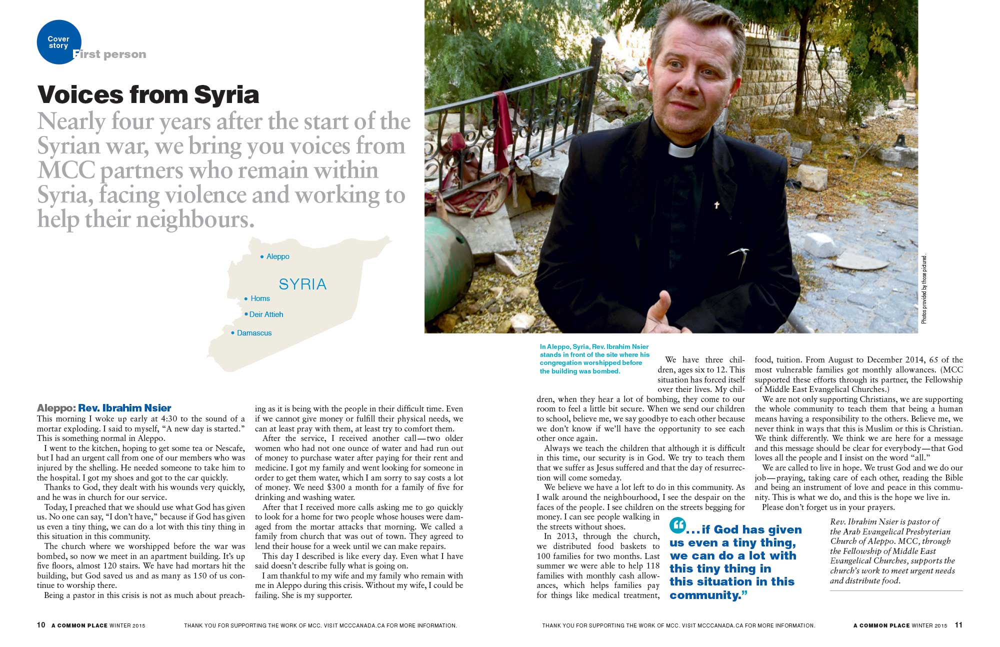
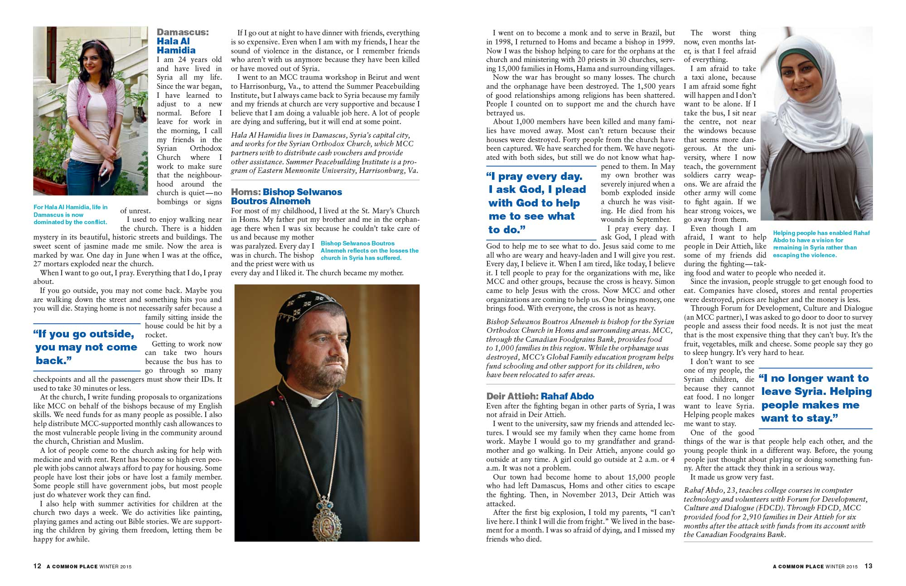
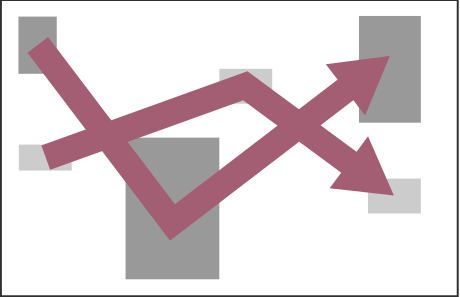
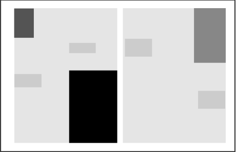
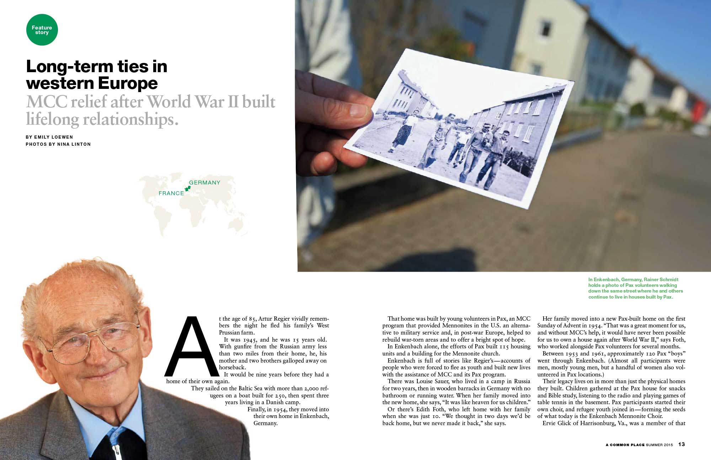
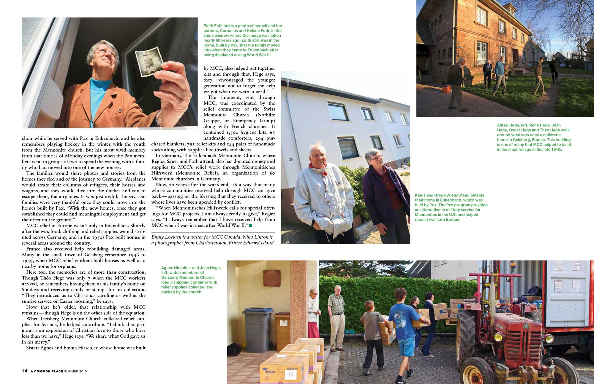
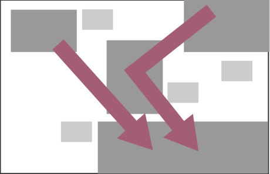
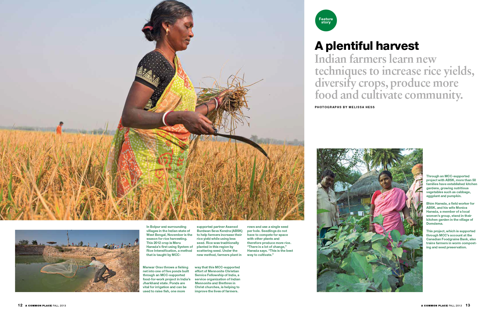
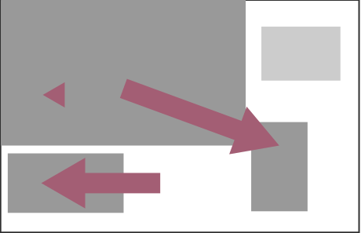
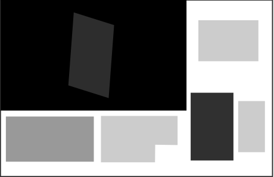

# Visual Orchestration 

Editorial design — the composing of headlines, images, pullquotes, captions and, often,  significant amounts of text in a graphically rich arrangement — is one of the joys of design, at least for me.

The two-page spread above began an article about improving the nutrition of villagers in Laos. How to convey learning to forage for protein-rich food? The opening spread is dominated by a large photograph of a student net fishing in a stream. The photograph is diagonally framed by two hands, one holding a cricket and the other wild plants.

Flow

Hierarchy

They add visual torc as well as information to the spread. The bottom of the page is anchored by a smaller photograph of a classroom. Altering the scale of images helps the reader navigate the page while creating a hierarchy of information.

## Voices from Syria ##

The story started life as a series of compelling interviews with Syrians who had chosen to remain in Syria as the country fell apart. While stories delivered a visceral impression of what it is like to live with a daily threat of violence, the photographs we had to support the story were mostly straightforward portraits. The photographs could have accompanied any article about anything. Each interview was a similar length.  The article needed some form of visual contrast to entice the casual reader into the stories.

ACP Winter 2015

The opening pages begin with Reverend Ibrahim Nsier’s account of living in Aleppo. The most visually arresting of the photographs, he stands in front of the bombed out building where his church formerly met for worship. Included also, was a map of Syria showing where each the stories come from. The second spread contained conventional photographs and larger amounts of text.

ACP Winter 2015")

Varying the size of the photographs to increase visual contrast and using pullquotes to create a point/counterpoint rhythm, hopefully, drew readers in the interviews.

Flow

Hierarchy

## Time and time again ##

An article detailing the connection between help given to French and German rural communities struggling to rebuild after World War II and their own contemporary efforts to aid Syrians affected by the current violent crisis seemed too large for the meagre four pages available.

ACP Summer

The first spread featured  a large photograph of a contemporary hand holding photograph taken in the early 1950s, during post-war European reconstruction. It shows American volunteers walking along the same street depicted the background. This was juxtaposed by a portrait of one of the boyhood recipients of the help, now in his eighties.

ACP Summer

The second page is much more visually dense with photographs of villagers who received help forming a “V” which points to the long horizontal photograph of a container being loaded with supplies destined for Syria refugees displaced in the Middle East. Two WWII recipients look on while the loading is done by younger members of the community. 

Flow

Hierarchy

## Room to grow ##

ACP autumn

A photographic essay made up of images with slightly extended captions presented plenty of scope for visual contrast. This spread has a clear hierarchy of size which is augmented by a strong movement in the content. A woman moving forward with a scythe thrusts the viewer to the right-hand page where they are stopped by a portrait of a woman in her garden. The smallest photograph on the left sets up a counter flow as a man throws his net in the opposite direction.

Flow

Hierarchy

Words and images both have the potential for storytelling. Images show what happened and also communicate on an emotional level. Words can filter out the extraneous details, and allow for precision in the sweep of what is reported. When words and pictures come together, a third element becomes important — the visual orchestration of the information. We engage with the images and read the text for more details. We are captured by the text and look at the images to illuminate points or add detail. How they are brought together can help the story or hinder it. When various chunks of information are presented at the same visual size and value, we don’t know where to start. Visual interest like good prose makes information easier to digest. It relates a meaning greater than the sum of the parts.
