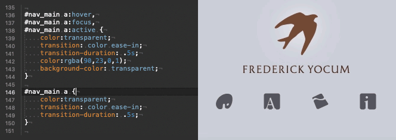
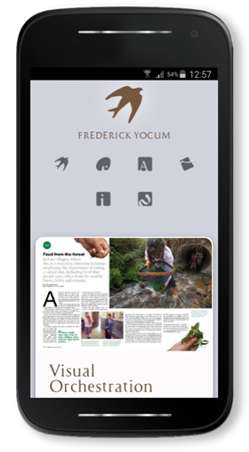

# col•o•phon

This site should hopefully validate as <abbr class="acronym">XHTML5</abbr>.  There is also a chance that it won’t. The temptation to try something new is always present and what better site to screw up than your own . . . .

My site isn’t large, edited by hundreds of people or populated by thousands of chunks of data. Was there a content management system that was open source, customizable, fast and well-supported? Most important, was there something set up so I could easily extract the content from the delivery system? The next time a move beckoned, I wanted to pick up my data and move on, without having to weed through hundreds of database entries.

## Grav

Enter [Grav](https://getgrav.org), an open source [flat file](https://medium.com/@yuzool/what-is-a-flat-file-cms-bac76760b40d) content management system originally developed by [Trilby Media](https://trilby.media/). Grav uses [Markdown](https://daringfireball.net/projects/markdown/) as the primary text formatting method, This added simplicity, since most of the writing I do is in Markdown already. It is a flat file <abbr class="acronym" title="content management system">CMS</abbr>. Each page on the site is held in a folder or set of folders containing standalone plain text files, written in Markdown, and images, if they are part of the content. You can remove and add blocks of content by dragging them in or out of the folder structure.

## What, no JavaScript?

No [JavaScript](https://en.wikipedia.org/wiki/JavaScript). As an intellectual exercise, I kept things as simple as I could. Ten years ago, if you wanted animation or transitions you needed to reach into your JavaScript toolbag. Today it is possible to just use <abbr class="acronym" title="Cascading Style Sheets">[CSS](https://www.w3.org/Style/CSS/)</abbr> on your <abbr class="acronym" title="Hypher Text Markup Language">[HTML](https://html.spec.whatwg.org/multipage/)</abbr>. 

## No hamburger

At least for now, there is no collapsing hamburger style (&#9776;) navigational widget at the top of each page with a list of all the [galleries](https://frederickyocum.com/art) or [posts](https://frederickyocum.com/writing) appearing at the click or hover of a hamburger icon. No list of visual thumbnails on the [gallery](https://frederickyocum.com/art/portraits) pages either. You can create these effects in <abbr class="acronym">CSS</abbr>, but I want readers to slow down and discover the content in a staged fashion. 

## Responding to the screen

I tried to keep the [media queries](https://www.w3.org/TR/css3-mediaqueries/) lean, and I have played with [flexbox](https://www.w3.org/TR/css-flexbox-1/), [grid](https://www.w3.org/TR/css-grid-1/) and [clamp()](https://drafts.csswg.org/css-values-4/#math) to enable things to appear reasonably well on large and small screens using the same style definitions. This is a work in progress, more fiddling around will be done, I am sure.

## Typefaces

The serif typeface used for headings and some subheadings are in Cyan, a typeface derived from the Roman square capitals on the inscription at the base of [Trajan's Column](https://en.wikipedia.org/wiki/Trajan's_Column). Robbie de Villiers, who started [Wilton Foundry](http://www.wiltonfoundry.com/), designed letters with both upper and lower case variations. Lower case letters are not common in the other variations of Trajan that exist.

The san-serif headlines and details are set in [Noto Sans](https://en.wikipedia.org/wiki/Noto_fonts), part of Noto, a font family commissioned by Google, with over 100 individual fonts, which are, together, designed to cover all the scripts encoded in the [Unicode](https://en.wikipedia.org/wiki/Unicode) standard.

Body copy is set in Palatino or failing that Times New Roman or whatever typeface with serifs you have set as [default](https://fontsarena.com/blog/operating-systems-default-serif-fonts/) on your viewing device.

If you have read through this article and ended up here, I hope you have taken some time to navigate over to [frederickyocum.com](https://frederickyocum.com/) and had a look around. If you have any thoughts, negative or positive, reach out and share them.